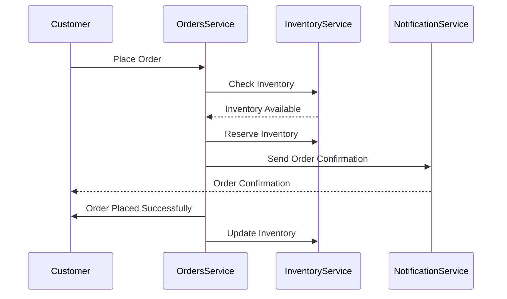

## Overview

The Orders domain handles all operations related to customer orders, from creation to fulfillment. This documentation provides an overview of the events and services involved in the Orders domain, helping developers and stakeholders understand the event-driven architecture.

<Admonition type="warning">Please ensure all services are updated to the latest version for compatibility and performance improvements.</Admonition>

## Vocabulary

<AccordionGroup>
  <Accordion title="Agent">
    An User who assists customers.
  </Accordion>
   <Accordion title="Department">
     A department with agents.
  </Accordion>
  <Accordion title="Units">
     A unit is a logical division of departments. A unit is composed by multiple departments oversight by a Monitor
  </Accordion>
  <Accordion title="Monitor">
     Monitors are “supervisors” of units, they have access to view all chats within their unit.
  </Accordion>
  <Accordion title="Visitor">
     A customer who looking for help, it can reach the support through multiple channels (Widget, WhatsApp, VOIP, etc)
  </Accordion>
  <Accordion title="Contact">
     An entity who groups "same" visitors together (can be verified or not).
  </Accordion>
  <Accordion title="Business Hour">
     Allows admins to define hours where service must be available or unavailable. 
  </Accordion>
</AccordionGroup>

## Bounded context

<NodeGraph />

### Order example (sequence diagram)

 